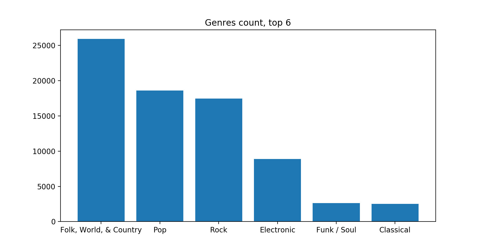
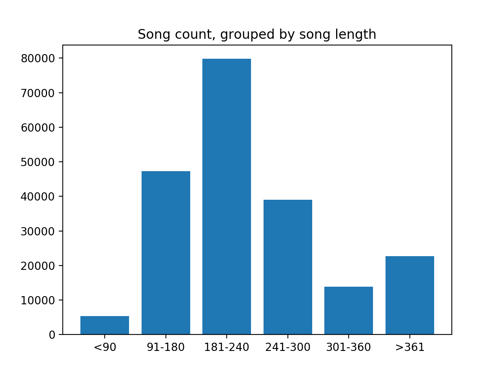
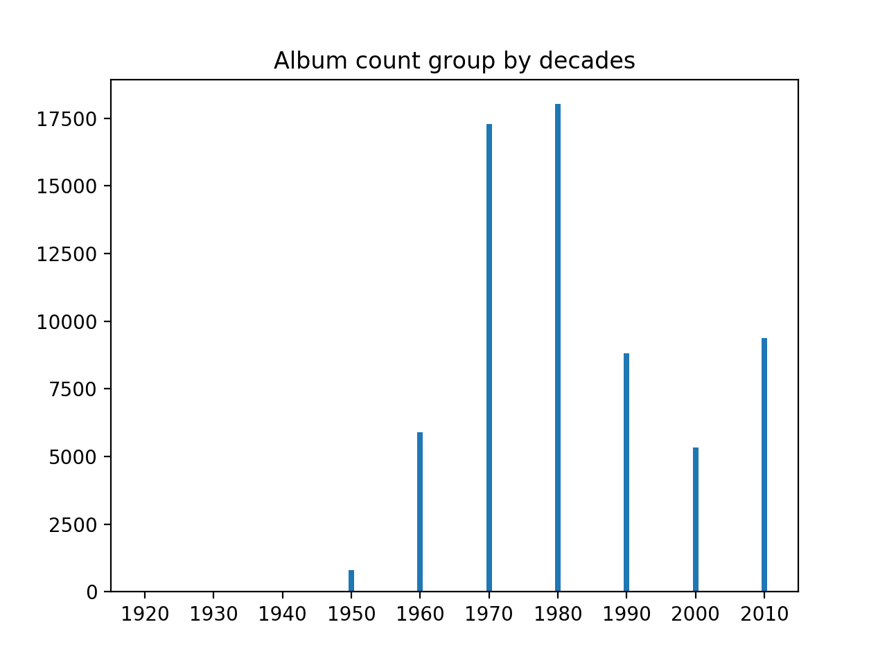
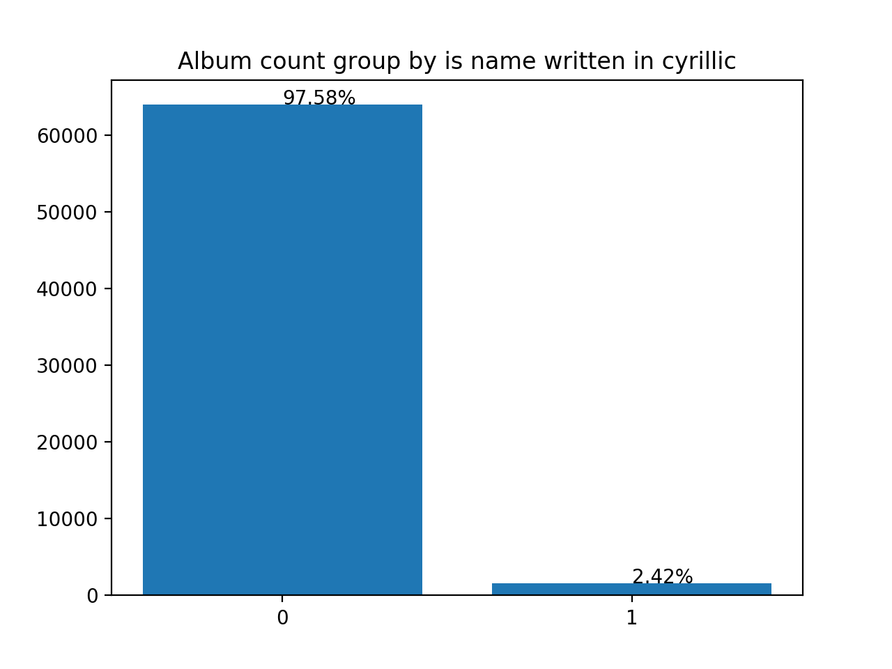
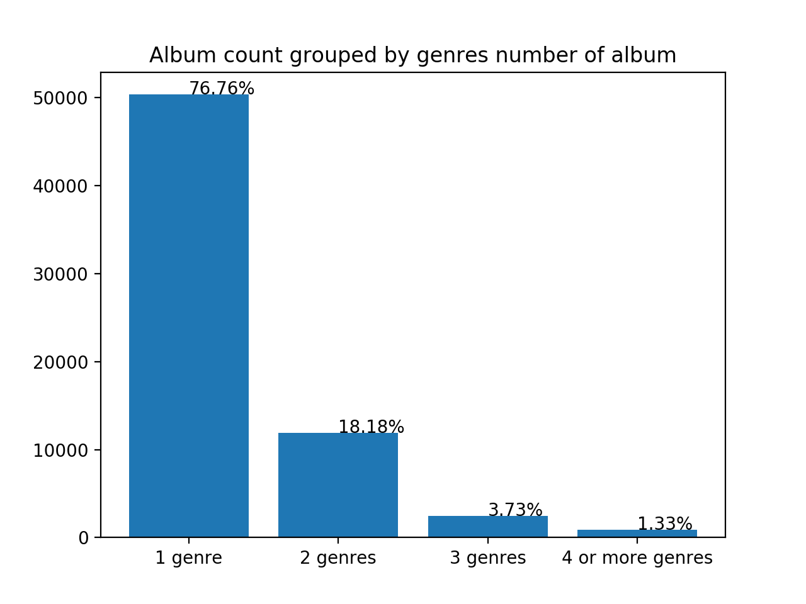

## Music-scraper-clusterizer:

### Description:
* Project done for faculty course [hidden knowledge](http://rti.etf.bg.ac.rs/rti/ms1psz/). 
* Subject of project was:
    1. Web scraping of site [discogs](https://www.discogs.com/) for data about albums, songs, and artists
    of Yugoslavia and Serbia.
    2. Analyses of scraped data with plotting and querying.
    3. Unsupervised clustering of scraped data.
    
### How to run:
* Install python 3.7
* Install docker
* Install needed modules with: pip install -r requirements.txt
* Run database in docker: docker-compose -f docker-compose.yml up -d
* Change dir from root to /src
* Run project with: python main.py

### Results:

#### Scraping:

* Scraping time: 72h
* Albums scraped: 65573
* Artists scraped: 62025
* Songs scraped: 435107

#### Plotting:
* Genres count, top 6:

* Song count, grouped by song length:

* Album count, grouped by decades:

* Album count, grouped by is name written in cyrillic:

* Album count, grouped by genres number of album:

